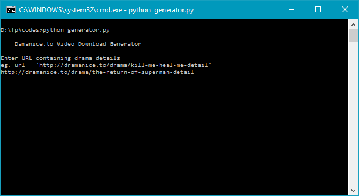

# Dramanice-Video-Link-Generator
A simple python3 script to generate video links from [dramanice.to](http://dramanice.to) pages.

## Motivation and Working
Due to slow but unlimited bandwidth, I had to download episodes in night while I'm asleep and watch later.
But manually finding the download links of the videos and adding it to the download manager is no less boring.
I needed the download link of all the episodes; web scraping came to my rescue. This python script takes the details 
page of a particular drama and parses links to all the episodes of that drama. For each episode, the episode view page 
is again scraped for embeded html5 video links. jwplayer link is currently not supported, maybe I'll add this in future.

## Usage
Install python3, beautiful soup, and urllib.requests first.
To run the script:
```
python generator.py
```


It will prompt to enter the link


Now enter the drama details page eg. "http://dramanice.to/drama/the-return-of-superman-detail"



Now press ```Enter```


That's it.